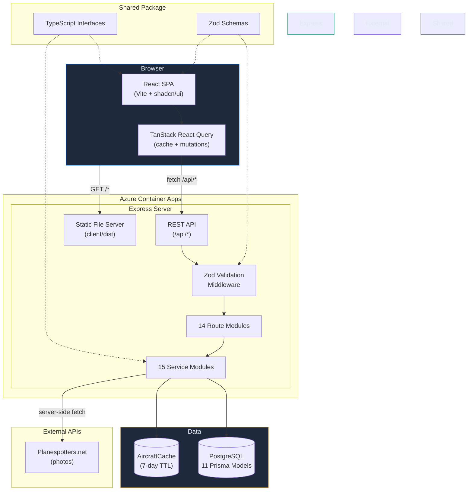

# PanelForge — Architecture

## System Overview

PanelForge is a TypeScript monorepo with three workspaces:

```
panelforge/
├── client/           React SPA (Vite)
├── server/           Express API + Prisma ORM
└── packages/shared/  Shared types and validation schemas
```

The client communicates with the server over a REST API. The server owns all business logic and database access. The shared package provides TypeScript interfaces and Zod validation schemas consumed by both sides.



### How it fits together

1. **Browser** — The React SPA renders the UI and manages server state through React Query. All data fetching goes through `/api/*` endpoints.
2. **Express Server** — Serves the built client as static files and handles all API routes. Requests pass through Zod validation middleware before reaching service logic.
3. **Services** — 15 modules encapsulating business logic. Each service owns a domain (boards, pins, power budget, aircraft, etc.) and talks to PostgreSQL via Prisma.
4. **External APIs** — Aircraft photos are fetched server-side from Planespotters.net (never from the browser) to bypass CDN hotlink restrictions. Aircraft metadata comes from a static lookup table. Results are cached in the database.
5. **Shared Package** — TypeScript types and Zod schemas are consumed by both client and server, ensuring type safety end-to-end without duplication.

## Technology Stack

| Layer | Technology |
|-------|-----------|
| Frontend | React 19, React Router 7, TanStack React Query 5, shadcn/ui (Radix + Tailwind CSS 4), Vite 7 |
| Backend | Node.js 20, Express 4, Prisma 6 |
| Database | PostgreSQL |
| Validation | Zod 3 (shared between client and server) |
| Testing | Vitest, Testing Library, supertest |
| Build | Vite (client), tsc (server/shared), tsx (dev server) |
| Container | Docker (node:20-slim) |
| CI/CD | GitHub Actions |
| Hosting | Azure Container Apps + Azure Container Registry |

## Monorepo Structure

```
panelforge/
├── .github/workflows/deploy.yml    CI/CD pipeline
├── client/
│   ├── src/
│   │   ├── App.tsx                 Router + sidebar navigation
│   │   ├── pages/                  10 feature pages
│   │   ├── components/
│   │   │   ├── ui/                 shadcn/ui primitives
│   │   │   ├── panel-map/          Map canvas, flyouts, wizard
│   │   │   ├── calibration/        Section boundary editor
│   │   │   └── component-library/  Type form components
│   │   ├── hooks/                  React Query hooks (data layer)
│   │   └── lib/                    API client, power-calc, constants
│   ├── tsconfig.app.json           Strict TS config (erasableSyntaxOnly, verbatimModuleSyntax)
│   └── vite.config.ts              Dev server proxy → localhost:3001
├── server/
│   ├── src/
│   │   ├── index.ts                Entry point (listen)
│   │   ├── app.ts                  Express app setup (helmet, cors, morgan, static files)
│   │   ├── config.ts               Environment config
│   │   ├── routes/                 14 route modules
│   │   ├── services/               15 service modules
│   │   ├── lib/
│   │   │   ├── prisma.ts           Singleton Prisma client
│   │   │   ├── errors.ts           AppError class
│   │   │   ├── async-handler.ts    Express async wrapper
│   │   │   ├── validate.ts         Zod validation middleware
│   │   │   └── schemas.ts          Route-level Zod schemas
│   │   ├── middleware/             Error handler
│   │   └── data/                   Static data (BAe 146 production table, LVAR library)
│   └── prisma/
│       ├── schema.prisma           Data model (11 models)
│       ├── migrations/             11 migration files
│       └── seed.ts                 Development seed data
├── packages/shared/
│   └── src/
│       ├── types/                  11 type definition files
│       └── validators/             Zod schemas (entity CRUD)
├── Dockerfile                      Production image
├── docker-compose.yml              Local PostgreSQL
├── package.json                    Workspace root
└── tsconfig.base.json              Shared TS base config
```

## Backend Architecture

### Request Flow

```
HTTP Request
    │
    ▼
Express Router (routes/*.ts)
    │
    ├── validate(zodSchema)     Zod middleware rejects invalid bodies
    │
    ├── asyncHandler()          Catches promise rejections
    │
    ▼
Service Layer (services/*.ts)   Business logic + Prisma queries
    │
    ▼
Prisma ORM                     Type-safe PostgreSQL access
    │
    ▼
PostgreSQL
```

### Service Layer

Services are plain objects with async methods — no classes, no dependency injection. Each service owns a domain:

| Service | Responsibility |
|---------|---------------|
| `board` | Board CRUD, auto-generates pin assignment rows on create |
| `panel-section` | Section CRUD, aggregated summaries |
| `component-type` | Component library CRUD, usage counting |
| `component-instance` | Instance CRUD, map data, cascade deletes |
| `pin-assignment` | Pin CRUD, bulk updates, filtered queries |
| `mosfet` | MOSFET board CRUD, auto-generates channels |
| `build-progress` | Status aggregation, status cascade (component → pins) |
| `power-budget` | Load calculation data, PSU config singleton |
| `bom` | Allocation calculation + transactional apply |
| `mobiflight` | Device mapping, export, LVAR auto-assign |
| `lvar-reference` | In-memory LVAR search + fuzzy suggestion |
| `wiring` | Signal path data for diagram rendering |
| `journal` | Build log CRUD with filters |
| `export` | Full database JSON dump/restore |
| `aircraft` | External API fetch, cache, photo proxy |

### Error Handling

- `AppError(status, message)` thrown by services for expected errors (404, 400, 409)
- `asyncHandler` catches unhandled promise rejections in routes
- Global error middleware formats all errors as `{ error: string }` JSON responses
- Prisma errors (unique constraint, not found) caught and mapped to AppError

### Validation

Two layers:

1. **Route-level** — Zod schemas in `lib/schemas.ts`, applied via `validate()` middleware
2. **Shared** — Zod schemas in `packages/shared/src/validators/`, importable by client for form validation

### Database Schema

11 Prisma models across 3 domains:

**Panel & Components**
- `PanelSection` — physical panel area with dimensions, lineage, SVG coords
- `ComponentType` — reusable hardware definition (pin config, power specs)
- `ComponentInstance` — placed component with map position and build status

**Electrical Routing**
- `Board` — Arduino Mega (54 digital + 16 analog pins)
- `PinAssignment` — pin-to-component mapping with wiring status
- `MosfetBoard` / `MosfetChannel` — high-voltage driver boards
- `MobiFlightMapping` — sim variable binding per pin

**Supporting**
- `PsuConfig` — singleton power supply configuration
- `JournalEntry` — build log entries
- `AircraftCache` — cached external aircraft data (keyed by MSN)

Key relationships:

```
PanelSection 1──* ComponentInstance *──1 ComponentType
                       │
                       1
                       │
                       *
                 PinAssignment *──1 Board
                       │
                       ├──? MosfetChannel *──1 MosfetBoard
                       │
                       └──? MobiFlightMapping
```

## Frontend Architecture

### State Management

All server state is managed through **TanStack React Query**. There is no Redux or global state store. The pattern is:

```
Page Component
    │
    ├── useQuery hook (fetches + caches data)
    │
    ├── useMutation hook (writes + invalidates cache)
    │
    └── Local useState (UI-only state: modals, filters, selections)
```

Query keys follow a consistent hierarchy (`['panel-sections']`, `['panel-sections', id]`, `['aircraft', msn]`) enabling targeted cache invalidation on mutations.

### Routing

React Router v7 with a sidebar layout:

```
/                    PanelMapPage
/components          ComponentLibraryPage
/pins                PinManagerPage
/calibrate-sections  SectionCalibrationPage
/power               PowerBudgetPage
/wiring              WiringDiagramPage
/bom                 BomGeneratorPage
/mobiflight          MobiFlightPage
/journal             JournalPage
/reference           ReferencePage
```

### Component Patterns

- **shadcn/ui** for all base components (Button, Card, Badge, Dialog, Tabs, Select, Skeleton, etc.)
- **Compound components** for complex UI (command palette, editable fields)
- **Inline editing** — click-to-edit pattern for dimensions, MSN fields, notes
- **Toast notifications** via Sonner for mutation feedback
- **Loading states** with Skeleton components matching the layout shape

### API Client

A thin wrapper around `fetch` at `lib/api.ts`:

```typescript
api.get<T>(path)              // GET /api/{path}
api.post<T>(path, body)       // POST with JSON body
api.patch<T>(path, body)      // PATCH with JSON body
api.delete(path)              // DELETE
```

In development, Vite proxies `/api` requests to `localhost:3001`. In production, Express serves the built client as static files and handles `/api` routes directly.

## External Integrations

### Aircraft Lineage

The aircraft service uses a static lookup table for aircraft metadata and Planespotters.net for photos, caching results in PostgreSQL:

```
Client request → /api/aircraft/:msn
                       │
                       ▼
              Check cache (TTL: 7 days)
                       │ (miss or expired)
                       ▼
              Resolve MSN → registrations
              ┌─────────────────────────┐
              │ BAe 146 lookup table    │
              │ (all historical regs)   │
              └─────────────────────────┘
                       │
                       ▼
              Fetch photos (Promise.allSettled)
              ┌─────────────────────────┐
              │ Planespotters × N regs  │
              │ (deduplicate + cap 10)  │
              └─────────────────────────┘
                       │
                       ▼
              Upsert cache + return
```

A static lookup table (`data/bae146-production.ts`) provides MSN-to-registration mappings for the specific BAe 146 airframes the panels were sourced from. The BAe 146 is a retired fleet (~394 airframes), so live aviation APIs don't reliably cover these aircraft. The static table stores all known historical registrations per MSN, enabling photo searches across the aircraft's full identity chain.

Photos are fetched from Planespotters.net across all known registrations and served through `/api/aircraft/photo-proxy` to bypass CDN hotlink protection.

### MobiFlight Connector

The export service generates `.mfmc` JSON files compatible with MobiFlight Connector. It maps pin assignments to MobiFlight device types:

| Pin Mode | MobiFlight Device |
|----------|------------------|
| INPUT | Button |
| OUTPUT | Output |
| PWM | LedModule |
| Gauge (2-pin) | Stepper (DIR + STEP pair) |

An LVAR reference library (`bae146_ovhd_lvars.json`) provides fuzzy-matched variable suggestions when auto-assigning sim variables to pins.

## Security

- **Helmet** — sets secure HTTP headers (CSP, CORP, COOP, etc.)
- **CORS** — configured for same-origin in production
- **No authentication** — single-user tool, not multi-tenant
- **API key protection** — aircraft API keys stay server-side, never exposed to client
- **Photo proxy** — URL whitelist restricted to `t.plnspttrs.net`
- **Input validation** — Zod schemas on all mutation endpoints
